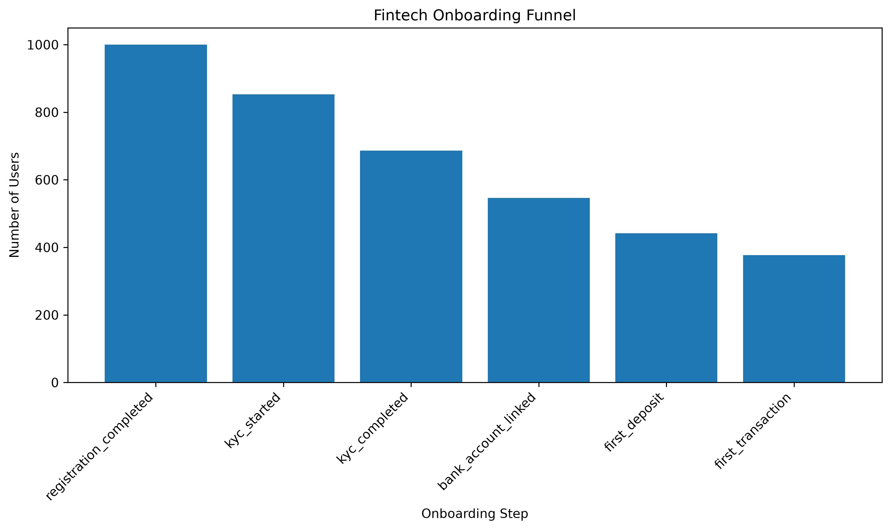

# fintech-onboarding-analytics
A product analytics case study focused on onboarding, activation, and retention in a digital wallet.

## Current Results

Using a synthetic dataset of 1,000 users, the current onboarding funnel is:

- 1,000 registrations
- 853 KYC starts
- 686 KYC completions
- 546 bank accounts linked
- 442 first deposits
- 377 first transactions

The current activation rate is 37.7%.

The largest percentage drop-off occurs between KYC completion and bank account linking.

## Funnel Visualization

